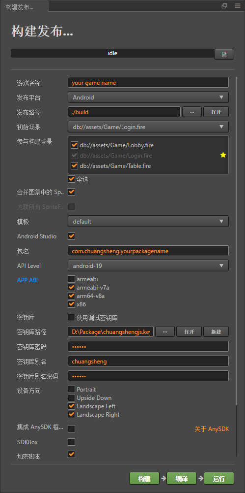

# <span id = "build APK">build APK</span>

* [1 替换icon 游戏名](#content1)
* [2 修改各种key](#content2)
* [3 全局替换包名](#content3)
* [4 打包及热更新配置](#content4)
* [5 热更新](#content5)
* [6 放至服务器](#content6)


### <span id = "content1">1 替换icon 游戏名</span> <button style="text-transform: none; margin: 15px; display: inline-block; font-weight: 400; text-align: center; vertical-align: middle; user-select: none; border: 1px solid #17a2b8; padding: 8px 8px; font-size: 16px; line-height: 16px; border-radius: 2.5px; color: #17a2b8; background-color: transparent; background-image: none; border-color: #17a2b8;">[back to content](#content)</button>

* 用美术资源替换路径(`子游戏\build-templates\jsb-default\frameworks\runtime-src\proj.android-studio\app\res`)下的各种尺寸的`mipmap`

* 同上路径下的`values`文件夹内`strings.xml`游戏名修改

```xml

<string name="app_name">your game name</string>
```

### <span id = "content2">2 修改各种key</span> <button style="text-transform: none; margin: 15px; display: inline-block; font-weight: 400; text-align: center; vertical-align: middle; user-select: none; border: 1px solid #17a2b8; padding: 8px 8px; font-size: 16px; line-height: 16px; border-radius: 2.5px; color: #17a2b8; background-color: transparent; background-image: none; border-color: #17a2b8;">[back to content](#content)</button>

* `Define.js`or`Platform.js`里的`LOGIN_SERVER_IP`改为服务器IP(可以参考下面写法)

```javascript
LOGIN_SERVER_IP = cc.sys.isNative ? 'xxx.xxx.xxx.xxx' : '127.0.0.1'
```

* `WXSDK_APPID` `WEIXIN_SECRET`

* 高德key(`子游戏\build-templates\jsb-default\frameworks\runtime-src\proj.android-studio\app\AndroidManifest.xml`)
  修改`android:value`

```xml
<!-- 设置key -->
<meta-data
        android:name="com.amap.api.v2.apikey"
        android:value="a89822dd08c049a41a74eb595184c47d"/>
        <!-- 定位需要的服务 -->
<service android:name="com.amap.api.location.APSService"></service>
```

### <span id = "content3">3 全局替换包名</span> <button style="text-transform: none; margin: 15px; display: inline-block; font-weight: 400; text-align: center; vertical-align: middle; user-select: none; border: 1px solid #17a2b8; padding: 8px 8px; font-size: 16px; line-height: 16px; border-radius: 2.5px; color: #17a2b8; background-color: transparent; background-image: none; border-color: #17a2b8;">[back to content](#content)</button>

* 首先将一个文件夹名改成包名！！！
  路径(`子游戏\build-templates\jsb-default\frameworks\runtime-src\proj.android-studio\app\src\com\chuangsheng\xxx`)  
  部分游戏可能不是以`com\chuangsheng\`开头，就按照src路径下的最近三个子路径（如上`com\chuangsheng\xxx`，即为包名`com.chuangsheng.xxx`
  ），将`com.chuangsheng.xxx`改为`com.chuangsheng.yourpackagename`

* 用`Notepad++`or编译器(`vscode` `webstorm`)全局替换包名  
  查找路径为：`子游戏\build-templates\jsb-default\frameworks`  
  全局替换`com.chuangsheng.xxx`为`com.chuangsheng.yourpackagename`


### <span id = "content4">4 打包及热更新配置</span> <button style="text-transform: none; margin: 15px; display: inline-block; font-weight: 400; text-align: center; vertical-align: middle; user-select: none; border: 1px solid #17a2b8; padding: 8px 8px; font-size: 16px; line-height: 16px; border-radius: 2.5px; color: #17a2b8; background-color: transparent; background-image: none; border-color: #17a2b8;">[back to content](#content)</button>


* 点击导航栏`项目` -> `构建发布` (或直接热键`Ctrl+Shift+B`) 参照下图详细配置



* 配置完毕点击`构建`，构建成功后进行热更新配置

* 点击导航栏`项目` -> `热更新工具` (或直接热键`Ctrl+H`，2.x之后为`Ctrl+U`)

    * `版本号`键入`1.0.0.0`

    * `资源服务器url`键入`yourserverip/update`

    * 点击`生成`，下方提示`打包1.0.0.0成功`

    * 点击`导入manifest`将manifest写入当前游戏

* 重新`Ctrl+Shift+B`打开`构建发布`点击`构建`，成功后点击`编译`，`compile success`即产出apk包（在路径`子游戏\build\jsb-default\publish\android`下）

### <span id = "content5">5 热更新</span> <button style="text-transform: none; margin: 15px; display: inline-block; font-weight: 400; text-align: center; vertical-align: middle; user-select: none; border: 1px solid #17a2b8; padding: 8px 8px; font-size: 16px; line-height: 16px; border-radius: 2.5px; color: #17a2b8; background-color: transparent; background-image: none; border-color: #17a2b8;">[back to content](#content)</button>


`Ctrl+Shift+B`打开`构建发布`点击`构建`，构建成功后

`Ctrl+H`or`Ctrl+U`打开`热更新工具`迭代`版本号`点击`生成`

### <span id = "content6">6 放至服务器</span> <button style="text-transform: none; margin: 15px; display: inline-block; font-weight: 400; text-align: center; vertical-align: middle; user-select: none; border: 1px solid #17a2b8; padding: 8px 8px; font-size: 16px; line-height: 16px; border-radius: 2.5px; color: #17a2b8; background-color: transparent; background-image: none; border-color: #17a2b8;">[back to content](#content)</button>


将热更新包（路径为`子游戏\packVersion`）放入`C:\phpStudy\PHPTutorial\WWW\update`中解压