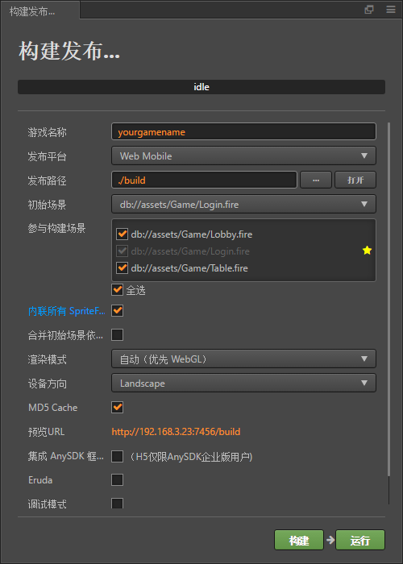

# <span id = "build web">build web</span>

* [1 公众号配置搭建](#content1)
* [2 打包](#content2)

## <span id = "content1">1 公众号配置搭建</span> <button style="text-transform: none; margin: 15px; display: inline-block; font-weight: 400; text-align: center; vertical-align: middle; user-select: none; border: 1px solid #17a2b8; padding: 8px 8px; font-size: 16px; line-height: 16px; border-radius: 2.5px; color: #17a2b8; background-color: transparent; background-image: none; border-color: #17a2b8;">[back to content](#content)</button>

进入<a href = "https://mp.weixin.qq.com/" title="不会吧不会吧">微信公众平台官网</a>，登录。

> 若为初次搭建该项目需要先关注公众号，为了方便后续工作需要将自己绑定为管理员

### 管理员绑定

左侧`设置`，点击`人员设置` -> `绑定运营者微信号` -> 输入自己微信号，搜素，绑定

### 微信key记录

左侧`开发`，点击`基本配置`

* 记录`开发者ID(AppID)`

* 记录`开发者密码(AppSecret)`

* `IP白名单`添加服务器IP

### 域名设置

进入`公众号设置` -> `功能设置`

首先点击下载`txt文件`，将文件复制到两个目录下（目录一`C:\phpStudy\PHPTutorial\WWW\`目录二`C:\phpStudy\PHPTutorial\WWW\game\`）。便于进行域名填写。

* 业务域名 域名1为 `产品提供的域名` 域名2为 `产品提供的域名\game` （即上方目录的映射

* JS接口安全域名 域名1为 `产品提供的域名` 域名2为 `产品提供的域名\game`

* 网页授权域名 只填入 `产品提供的域名` 即可

### 自定义菜单设置

* 左侧`功能`，点击`自定义菜单`，设置菜单内容为`跳转网页`，其中页面地址为
  `https://open.weixin.qq.com/connect/oauth2/authorize?appid=yourwxappid&redirect_uri=yourdomainname/game&response_type=code&scope=snsapi_userinfo&state=0#wechat_redirect`

即文件（`子游戏\build-templates\web-mobile\index.php`）的网址拼凑

```php
<?php
if(@$_GET["Jump"] == 1){
  $url="https://open.weixin.qq.com/connect/oauth2/authorize?appid=yourwxappid&redirect_uri=yourdomainname/game&response_type=code&scope=snsapi_userinfo&state="; 
  $url = $url.$_GET["state"]."#wechat_redirect";
  header("Location: ".$url); 
}
require_once "../jssdk.php";
$jssdk = new JSSDK("yourwxappid", "yourwxappsecret");
$signPackage = $jssdk->getSignPackage();
?>
```

> 如果出现`redirect_uri`不一致，要检查上方php是否有语法错误  
> 同时php内的`yourwxappid` `yourwxappsecret`也要对应修改

地址输入完毕，点击`保存并发布`
同时路径`子游戏\build-templates\web-mobile\`下的`splash.png`也要替换为当前项目加载图

## <span id = "content2">2 打包</span> <button style="text-transform: none; margin: 15px; display: inline-block; font-weight: 400; text-align: center; vertical-align: middle; user-select: none; border: 1px solid #17a2b8; padding: 8px 8px; font-size: 16px; line-height: 16px; border-radius: 2.5px; color: #17a2b8; background-color: transparent; background-image: none; border-color: #17a2b8;">[back to content](#content)</button>

* `Define.js`or`Platform.js`里的`LOGIN_SERVER_IP`改为服务器IP

* 点击导航栏`项目` -> `构建发布` (或直接热键`Ctrl+Shift+B`) 参照下图详细配置
  

* 点击`构建`

* 构建完毕后在目录（`子游戏\build`）下找到刚刚生成的`web-mobile`，使用`compression256.bat`or`pngOut.bat`进行包压缩，减小包的大小，方便游戏快速加载。

* 图集压缩完毕后，将`web-mobile`文件夹压缩

* 将压缩包`web-mobile`放入服务器`C:\phpStudy\PHPTutorial\WWW\`路径下

* 解压`web-mobile`到`web-mobile`，使用`H5发布.bat`一键发布